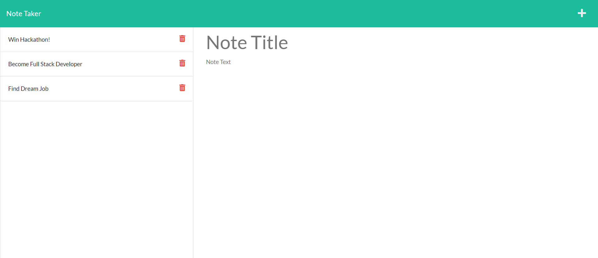

# Note Taker
<a href='https://opensource.org/licenses/MIT'></a>
  
## Table of Contents
[Description](#Description) 
[Usage](#Usage) 
[License](#License) 
[Questions](#Questions)

## Description
The purpose of this application is to provide the user with a dynamic note taker in which they can create notes, re-visit their notes, and delete them.

## Usage
The user can access the application at https://note-taker-padredilg.herokuapp.com/ . Once there, click Get Started, and start writing and manipulating notes! When a few notes are created, the user may check them directly on them, or they may add new notes by clicking the plus sign on the top right corner.  

</img>
</img>
</img>

## License
This application is covered under the <a href='https://opensource.org/licenses/MIT'>MIT License</a>

## Questions
<a href='https://github.com/Padredilg'>Padredilg</a> 
If you have any questions, you may email at padredilg@knights.ucf.edu
